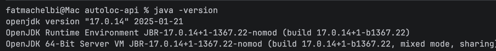

# AutoLoc

Plateforme de gestion de location de véhicules multi-agences, développée dans le cadre du module
**Architecture des Systèmes d'Information (ASI)** — ESPRIT, 2026-2027.

## Objectifs du projet

AutoLoc est une entreprise de location de véhicules disposant de plusieurs agences dans différentes villes.
L'objectif est de numériser l'ensemble du processus métier à travers une API REST Spring Boot :

- gestion des agences et de la flotte de véhicules (disponible, loué, en maintenance) ;
- gestion des clients et de leurs réservations ;
- contractualisation et enregistrement des paiements ;
- calcul des tarifs (catégorie, durée, période, équipements optionnels) ;
- tâches planifiées (libération des véhicules, alertes d'échéance) et statistiques.

## Acteurs

| Acteur | Rôle | Droits principaux |
|---|---|---|
| **Client** | Particulier ou professionnel souhaitant louer un véhicule | Consulter les véhicules disponibles, créer/annuler une réservation, consulter ses contrats |
| **Agent d'agence** | Employé chargé de la gestion opérationnelle d'une agence | Gérer les véhicules, valider une réservation, établir un contrat, enregistrer un paiement |
| **Responsable d'agence (Manager)** | Supervise une agence et son personnel | Droits Agent + gestion des employés, statistiques de l'agence |
| **Administrateur** | Administre la plateforme | Gestion des agences et des catégories, statistiques globales, configuration |

## Stack technique

Java 17 · Maven · Spring Boot · Spring Data JPA · MySQL · Lombok · IntelliJ IDEA · Postman · Git

## Environnement

Java 17 :

